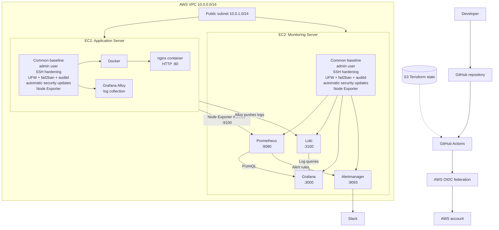

# Automated Linux Infrastructure Platform

> **Terraform + Ansible + AWS + Docker + Prometheus + Grafana + Loki + Grafana Alloy + Alertmanager + GitHub Actions**

[](https://github.com/modelav/linux-infra-platform/actions/workflows/validate.yml)

A DevOps project that provisions, hardens, configures, deploys, and observes a small Linux infrastructure platform on AWS.

> **Project status:** Phase 5 — CI/CD integration is in progress. Phases 1–4 are implemented, and the repository now has the Terraform → Ansible deployment chain in place. Phase 5 is not yet considered complete until the full main-branch path is verified end-to-end.

The project is intentionally being documented while it is being built.

---

## Table of contents

- [Automated Linux Infrastructure Platform](#automated-linux-infrastructure-platform)
  - [Table of contents](#table-of-contents)
  - [Project goals](#project-goals)
  - [Current status](#current-status)
- [Architecture](#architecture)
  - [Infrastructure and service architecture](#infrastructure-and-service-architecture)
  - [How to read this diagram](#how-to-read-this-diagram)
  - [Server responsibilities](#server-responsibilities)
    - [Network relationships](#network-relationships)
  - [Automation flow](#automation-flow)
    - [1. Infrastructure provisioning](#1-infrastructure-provisioning)
    - [2. Host configuration](#2-host-configuration)
    - [3. CI/CD delivery chain](#3-cicd-delivery-chain)
- [Technology stack](#technology-stack)
- [Security](#security)
  - [SSH and operating system](#ssh-and-operating-system)
  - [AWS network layer](#aws-network-layer)
  - [Secrets](#secrets)
  - [CI-to-AWS authentication](#ci-to-aws-authentication)
  - [Important scope note](#important-scope-note)
- [Observability](#observability)
  - [Metrics flow](#metrics-flow)
  - [Log flow](#log-flow)
  - [Current alert rules](#current-alert-rules)
- [Repository structure](#repository-structure)
  - [Why the Ansible roles are separated](#why-the-ansible-roles-are-separated)

---

## Project goals

build a small Linux infrastructure platform using Infrastructure as Code, configuration management, security hardening, application deployment, and observability.

The goal is not to build a complex application. The goal is to demonstrate that infrastructure can be:

- **Provisioned reproducibly** with Terraform.
- **Configured consistently** with idempotent Ansible roles.
- **Hardened by default** instead of relying on manual server changes.
- **Observed centrally** through metrics, logs, dashboards, and alerts.
- **Managed through Git** with validation and secure AWS authentication.
- **Extended toward CI/CD** without putting long-lived cloud credentials in GitHub Actions.

The intended end state is that the environment can be rebuilt from the repository rather than from undocumented manual server changes.

---

## Current status

The project implementation is phase by phase and is currently in **Phase 5**.

| Phase                                  | Status           | Current implementation                                                                                                                                                                                    |
| -------------------------------------- | ---------------- | --------------------------------------------------------------------------------------------------------------------------------------------------------------------------------------------------------- |
| 1. Provision infrastructure            | ✅ Implemented   | AWS VPC, public subnet, routing, security groups, SSH key, two EC2 instances, S3 remote state                                                                                                             |
| 2. Harden Linux servers                | ✅ Implemented   | `common` Ansible role: users, SSH hardening, UFW, fail2ban, auditd, automatic security updates, Node Exporter                                                                                             |
| 3. Deploy application                  | ✅ Implemented   | Docker + nginx on the application server; application content generated by Ansible                                                                                                                        |
| 4. Observability                       | ✅ Implemented   | Prometheus, Grafana, Loki, Grafana Alloy, Alertmanager, dashboard/configuration as code                                                                                                                   |
| 5. CI/CD                               | 🚧 In progress   | PR validation, Terraform apply, AWS OIDC, generated Ansible inventory, automated Ansible deployment, and post-deploy verification are implemented; end-to-end hardening/verification is still in progress |
| 6. Operational tooling & documentation | 🚧 Started early | Documentation is being added while Phase 5 is completed                                                                                                                                                   |

---

# Architecture

The platform has **two EC2 servers with different responsibilities**. A small shared Linux baseline is applied to both servers, while application and monitoring workloads are applied only to their respective hosts.

### Infrastructure and service architecture



### How to read this diagram

The important distinction is the separation of **shared configuration** from **role-specific services**:

- The **common baseline** is applied to **both EC2 servers**.
- **Docker, nginx, and Grafana Alloy** exist only on the **application server**.
- **Prometheus, Loki, Grafana, and Alertmanager** exist only on the **monitoring server**.
- Prometheus currently scrapes the application server's Node Exporter and also scrapes its own Prometheus endpoint.
- Grafana queries Prometheus for metrics and Loki for logs.
- Alertmanager receives alerts generated by Prometheus and sends notifications to Slack.

The distinction between `common`, `app`, and `monitoring` is represented directly in the Ansible playbook.

---

## Server responsibilities

| Server               | Shared baseline                                                                    | Server-specific services                 | Main purpose                                    |
| -------------------- | ---------------------------------------------------------------------------------- | ---------------------------------------- | ----------------------------------------------- |
| `project-app`        | admin user, SSH hardening, UFW, fail2ban, auditd, automatic updates, Node Exporter | Docker, nginx application, Grafana Alloy | Run the application and ship its logs           |
| `project-monitoring` | admin user, SSH hardening, UFW, fail2ban, auditd, automatic updates, Node Exporter | Prometheus, Loki, Grafana, Alertmanager  | Collect metrics/logs, visualize them, and alert |

### Network relationships

The monitoring server consumes telemetry from the application server:

```text
Application server
  ├── :9100  Node Exporter ────────────────> Prometheus
  └── Alloy ── logs over HTTP :3100 ───────> Loki

Monitoring server
  ├── Prometheus :9090
  ├── Loki :3100
  ├── Grafana :3000
  └── Alertmanager :9093

Prometheus ──> Grafana
Loki ────────> Grafana
Prometheus ──> Alertmanager ──> Slack
```

The current Prometheus configuration explicitly defines two scrape jobs: Prometheus itself and the application server's Node Exporter.

---

## Automation flow

The project has three related automation layers: infrastructure provisioning, server configuration, and the GitHub Actions delivery chain.

### 1. Infrastructure provisioning

```text
Terraform
   |
   +--> VPC
   +--> subnet + routing
   +--> security groups
   +--> SSH key association
   +--> application EC2
   +--> monitoring EC2
```

Terraform is responsible for **creating the infrastructure** and maintaining its state.

### 2. Host configuration

```text
Ansible
   |
   +--> common role       --> both servers
   |
   +--> app role          --> application server only
   |
   +--> monitoring role   --> monitoring server only
```

Ansible is responsible for **bringing existing servers to the desired operating-system and service configuration**.

### 3. CI/CD delivery chain

The newer Phase-5 implementation connects Terraform and Ansible through GitHub Actions:

```text
Pull Request
    |
    +--> validate.yml
    |      Terraform checks + Ansible lint
    |
    v
merge to main
    |
    v
Terraform Apply
    |
    +--> Terraform init
    +--> Terraform plan/apply
    +--> infrastructure updated
    |
    v
Ansible Deploy
    |
    +--> read Terraform outputs
    +--> generate bootstrap + normal inventories
    +--> bootstrap servers
    +--> apply site.yml
    +--> verify-inventory.yml
    |
    v
Verified infrastructure
```

The `Ansible Deploy` workflow can also be started manually. When triggered after the `Terraform Apply` workflow, it runs only when the upstream workflow completed successfully.

The inventory-generation script is important because Ansible does not rely on a hand-maintained list of server IPs: it reads the current Terraform outputs and generates the inventories required by the bootstrap and normal configuration stages.

This separation is intentional:

> **Terraform answers:** “Does the server and network exist?”  
> **Ansible answers:** “Is the server configured correctly?”

---

# Technology stack

| Technology         | Role in this project                                              |
| ------------------ | ----------------------------------------------------------------- |
| **AWS**            | Cloud infrastructure provider                                     |
| **Terraform**      | Infrastructure as Code and AWS resource provisioning              |
| **Ansible**        | Linux configuration management and application/service deployment |
| **Docker**         | Container runtime for the nginx application                       |
| **nginx**          | Small demonstration application                                   |
| **Node Exporter**  | Exposes Linux host metrics to Prometheus                          |
| **Grafana Alloy**  | Collects and forwards application/server logs                     |
| **Prometheus**     | Metrics collection and alert-rule evaluation                      |
| **Loki**           | Centralized log storage/querying                                  |
| **Grafana**        | Metrics and log visualization                                     |
| **Alertmanager**   | Alert routing and Slack notifications                             |
| **GitHub Actions** | Repository validation and Terraform automation                    |
| **AWS OIDC**       | Short-lived GitHub Actions authentication to AWS                  |
| **S3**             | Remote Terraform state storage                                    |
| **Ansible Vault**  | Encryption for sensitive Ansible values                           |

---

# Security

Security is implemented at several layers.

### SSH and operating system

Both servers receive the common Ansible role, which configures:

- A dedicated `admin` automation user.
- SSH key authentication.
- Disabled root SSH login.
- Disabled password-based SSH authentication.
- UFW firewall configuration.
- fail2ban for SSH brute-force protection.
- auditd for security-related auditing.
- Automatic security updates.

### AWS network layer

Terraform creates security groups and restricts administrative access using the configured administrator SSH CIDR. The application and monitoring ports are opened only where the architecture requires them.

### Secrets

Sensitive Ansible data is kept in an Ansible Vault encrypted file rather than plaintext configuration.

### CI-to-AWS authentication

GitHub Actions authenticates to AWS using GitHub's OIDC identity and an AWS IAM role instead of storing a long-lived AWS access key in repository secrets.

### Important scope note

This is a **portfolio-scale security design**, not a production security certification. The repository intentionally documents remaining hardening opportunities such as checksum verification for downloaded binaries, a more private management path, and tighter deployment connectivity.

---

# Observability

The monitoring design separates collection, storage, visualization, and notification responsibilities.

### Metrics flow

```text
Application server
      |
      | :9100
      v
Node Exporter
      |
      | scrape
      v
Prometheus (monitoring server)
      |
      +------> Grafana
      |
      +------> Alertmanager ------> Slack
```

The current Prometheus configuration scrapes:

- Prometheus itself (`localhost:9090`).
- The application server's Node Exporter (`app private IP:9100`).

### Log flow

```text
Application server
      |
      v
Grafana Alloy
      |
      | HTTP push
      v
Loki (monitoring server)
      |
      v
Grafana
```

Grafana is provisioned with Prometheus and Loki data sources through configuration files rather than requiring the project to depend on manual UI setup.

### Current alert rules

The repository contains rules for conditions including:

- Node Exporter unavailable.
- Prometheus unavailable.
- High CPU usage.
- High memory usage.
- High filesystem usage.

Alertmanager routes notifications to Slack.

---

# Repository structure

```text
.
├── .github/
│   └── workflows/
│       ├── ansible-deploy.yml
│       ├── aws-auth-test.yml
│       ├── terraform-apply.yml
│       ├── terraform-plan.yml
│       └── validate.yml
│
├── ansible/
│   ├── ansible.cfg
│   ├── bootstrap.yml
│   ├── requirements.yml
│   ├── site.yml
│   ├── verify-inventory.yml
│   ├── group_vars/
│   │   └── all/
│   ├── scripts/
│   │   └── generate-ansible-inventory.sh
│   └── roles/
│       ├── common/
│       │   ├── tasks/
│       │   ├── handlers/
│       │   └── templates/
│       ├── app/
│       │   ├── tasks/
│       │   ├── handlers/
│       │   └── templates/
│       └── monitoring/
│           ├── tasks/
│           ├── handlers/
│           └── templates/
│
├── terraform/
│   ├── bootstrap/
│   │   ├── github-oidc.tf
│   │   ├── github-oidc-policy.tf
│   │   └── github-actions-permissions.tf
│   ├── modules/
│   │   ├── networking/
│   │   └── server/
│   ├── backend.tf
│   ├── main.tf
│   ├── outputs.tf
│   ├── providers.tf
│   ├── variables.tf
│   └── backend.hcl.example
│
├── .gitignore
└── README.md
```

### Why the Ansible roles are separated

The role structure reflects the architecture:

```text
roles/
├── common/       # every server
├── app/          # application host only
└── monitoring/   # monitoring host only
```

This makes it possible to reason about a server from its inventory group instead of maintaining one large playbook full of host-specific conditionals.

---
